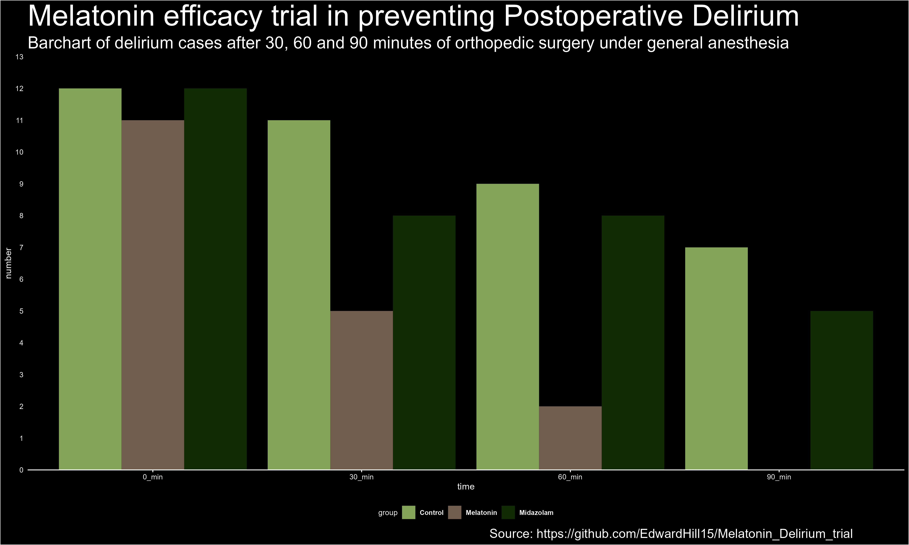
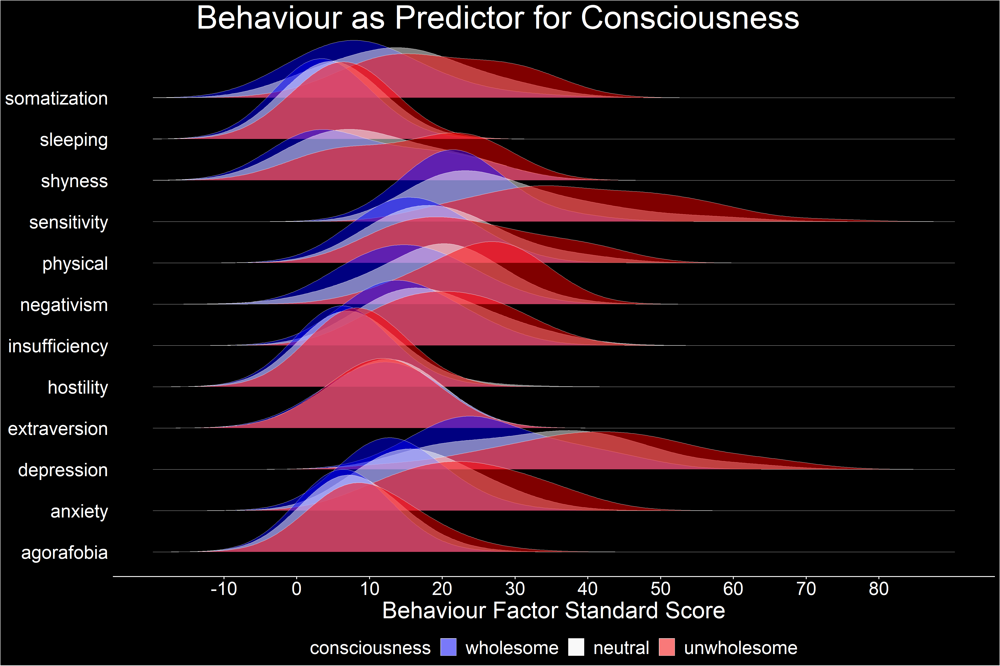

```{css echo=FALSE}
.author, .title, .date {
  display: none;
}

<!-- .main-container { -->
<!--   max-width: 100%; -->
}

body {
  background-color: black;
  color: white;
  font-family: Helvetica;
  font-size: 14pt;
}
/* Headers */
h1{
  font-size: 40pt;
}
```
<br>
<center>
# [Mind in a Holographic Field](content/holographic.html)
<br>
```{r echo=FALSE, out.width="40%"}
knitr::include_graphics("panvibrational.jpg")
```
<br>
<br>
<br>

# [Review Melatonin Delirium Study](content/melatonin.html)
<br>
```{r echo=FALSE, out.width="40%"}

```
<br>
<br>
<br>

# [Vibrational Consciousness](content/vibration.html)
<br>
```{r echo=FALSE, out.width="40%"}

```
<br>
<br>
<br>

# [Think yourself](content/fitheid.html)
<br>
```{r echo=FALSE, out.width="40%"}

```
<br>
</center>
